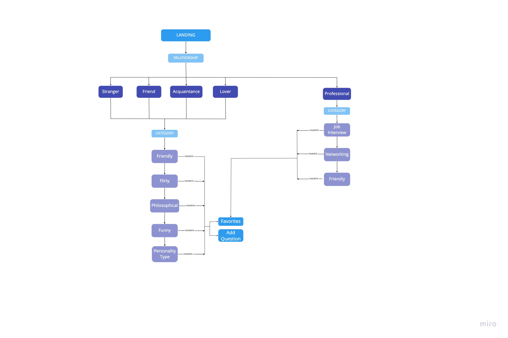
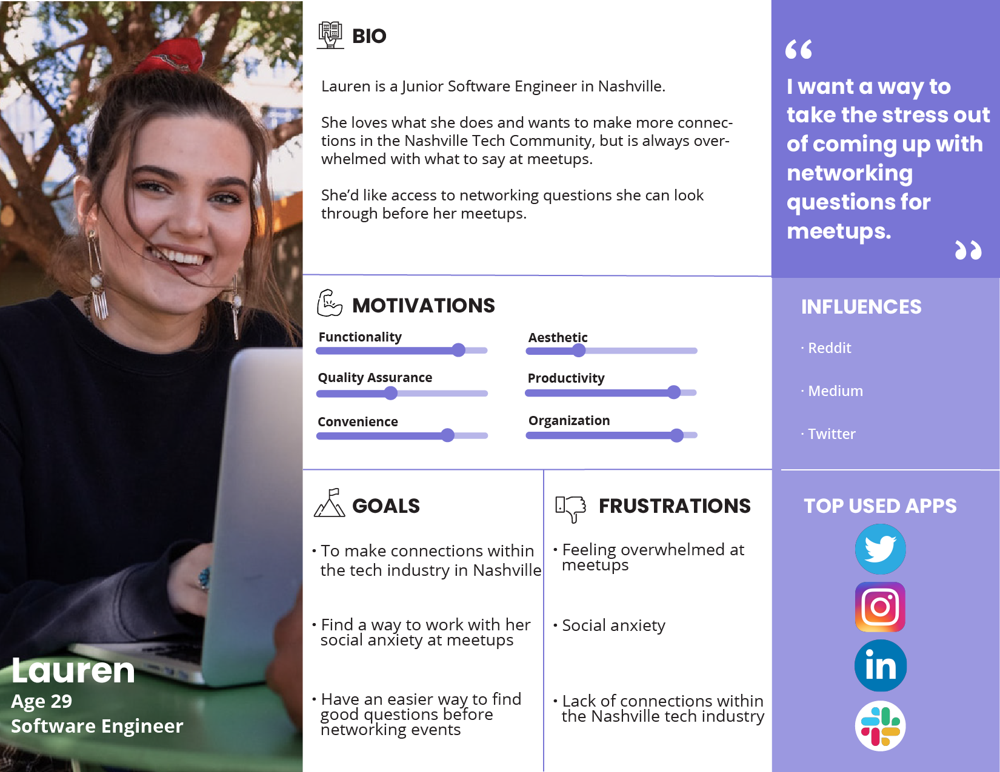
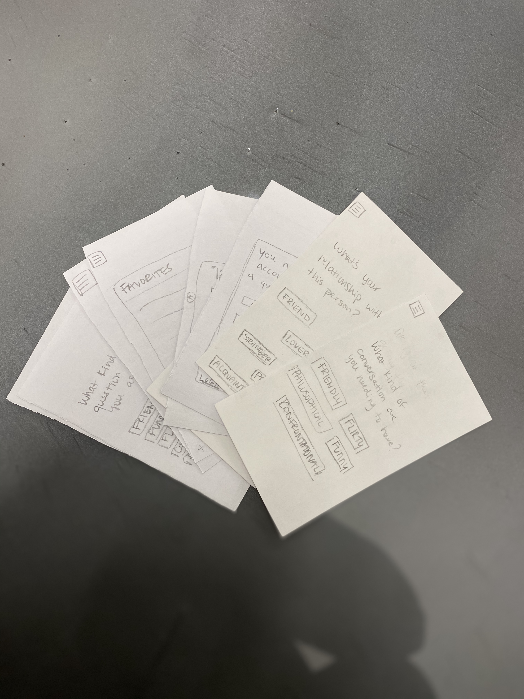
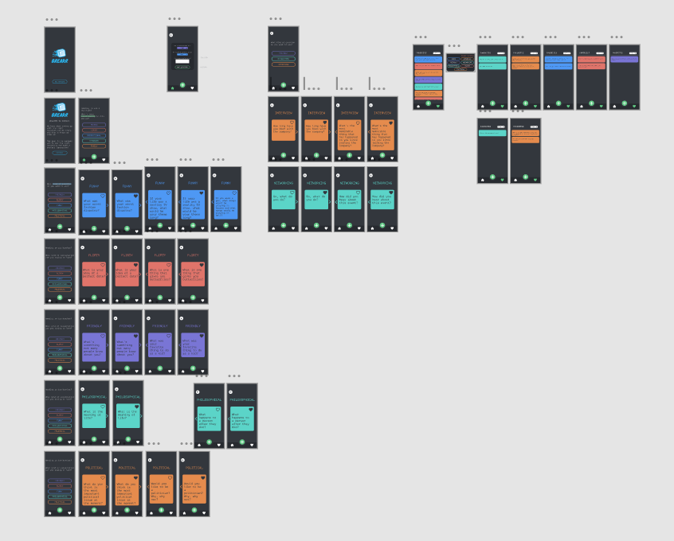
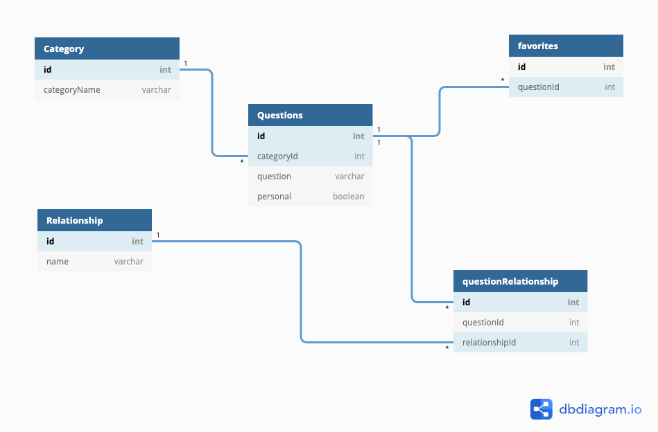

# Breakr
*Cohort 35 Capstone*

### Project Overview

Communication is an integral part of our lives. We interact daily with strangers, acquaintances, friends, and others that we love. For some people, it’s hard enough to make initial contact. The question then becomes “Well, what do I say?” Thanks to this app, starting a conversation will no longer be an issue. 

The app begins by asking you an initial question such as “What is your relationship with this person?”. You can choose from the four groups of “stranger, acquaintance, lover, and friend”. The app then ask you “what kind of conversation do you want to have?” You can choose from “casual, flirtatious, friendly, philosophical, supportive, and aggressive/confrontational”. The point of this app is to give people everything they need to start the conversation right by knowing who they are talking to and what type of conversation they hope to have. 

### Challenge Statement

How can we help users start meaningful conversations? 

### Research

I used a mixture of in person qualitative interviews and quantitative data from a survey I sent out to jumpstart my research process. The data I gathered proved invaluable to my app: I was able to narrow the scope of the application, create a user persona, and decide what options would be available within the app.

### User Interviews

I used the service, Typeform, for my user surveys along with in-person interviews. This information was invaluable in deciding what content I would have in the app for users to choose from. 

There were 48 participants in total for my survey.
* 89.6% of participants use the internet to search for questions to ask before a job interview.

* 64.6% try to think of questions before a date or networking event. 

* 69.7% consider themselves to be socially anxious.

* 75% were interested in my app concept.

* 65% of users would want questions grouped by relation and also kind of question they were asking. 

* The top five relationships chosen were: Friend, Lover, Professional, Stranger, and Family

* The top question categories were: Networking, Interview, Friendly, Flirty, Funny, Political, and Philosophical.
### Site Map

I planned out the site's information architecture by designing a site map, so I could plan the layout and features for the app.

 
### Persona

 
 

### Wireframes and Mockups

Thankfully, I had access to a whole school of potential users for this project. I started out with paper mockups so I could quickly and efficiently test and iterate my designs. All of the possible questions and relationships were based on what my users said they would like to see. 

 
 

Once I felt like I had enough feedback from my users, I decided to move into Figma and start mocking up and prototyping my app. I refined the UX and UI through testing, and I was able to edit my design based on feedback from multiple users. 

 

 
 

### Design System

For Breakr, I was inspired by dark mode and researched which colors best show up on a dark background. 

For typography, I chose the font PT Mono and the font Knewave for Breakr's logo. 

### Entity Relationship Diagram

Below outlines the ERD for this app.

## How to Run this App

#### Follow these steps exactly

1. `clone` this repository.
2. `cd` into the directory it creates.
3. Make a `database.json` file in the `api` directory.
4. Run `npm install` and wait for all dependencies to be installed.
5. Run `npm start` to verify that installation was successful.
